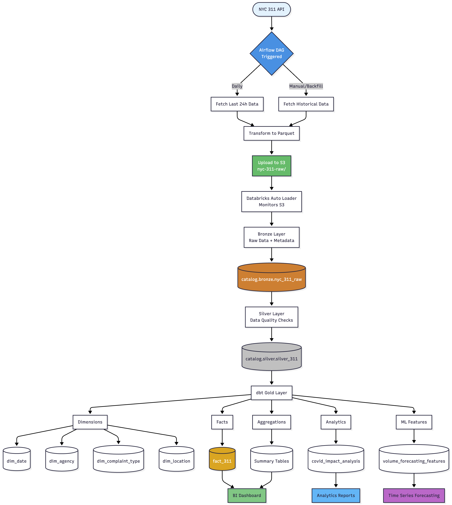

# NYC 311 Service Requests Data Pipeline

A production-ready data engineering pipeline for NYC 311 service requests using modern data stack. Implements Medallion Architecture (Bronze-Silver-Gold) with Apache Airflow, Databricks, dbt, and AWS S3.

[](https://airflow.apache.org)
[](https://databricks.com)
[](https://delta.io)
[](https://docs.databricks.com/data-governance/unity-catalog/)
[](https://www.getdbt.com)
[](https://python.org)
[](https://aws.amazon.com/s3/)

## Table of Contents

- [Architecture](#architecture)
- [Tech Stack](#tech-stack)
- [Data Flow](#data-flow)
- [Project Structure](#project-structure)
- [Quick Start](#quick-start)
  - [Prerequisites](#prerequisites)
  - [1. Infrastructure Setup (Terraform)](#1-infrastructure-setup-terraform)
  - [2. Start Airflow](#2-start-airflow)
  - [3. Deploy Databricks](#3-deploy-databricks)
  - [4. Run dbt Models](#4-run-dbt-models)
- [Data Layers](#data-layers)
  - [Bronze Layer (Raw Data)](#bronze-layer-raw-data)
  - [Silver Layer (Cleaned Data)](#silver-layer-cleaned-data)
  - [Gold Layer (Analytics-Ready)](#gold-layer-analytics-ready)
- [Testing](#testing)
- [Monitoring](#monitoring)
- [Security](#security)
- [Documentation](#documentation)
- [Development Workflow](#development-workflow)
- [Contributing](#contributing)
- [License](#license)

## Architecture

```
NYC 311 API → Airflow → AWS S3 → Databricks Bronze → Databricks Silver → dbt Gold → Analytics/ML
```
## Tech Stack

| Layer | Technology | Purpose |
|-------|------------|---------|
| Orchestration | Apache Airflow (Astronomer) | Data pipeline orchestration |
| Storage | AWS S3 | Raw data lake storage |
| Processing | Databricks (PySpark) | Data processing & cleaning |
| Transformation | dbt | Business logic & modeling |
| Infrastructure | Terraform | Infrastructure as code |
| Testing | pytest | Test automation |


## Data Flow



## Project Structure

```
nyc_311_project/
├── ingestion/                      # Airflow orchestration
│   ├── dags/
│   │   ├── nyc311_daily_ingestion.py
│   │   └── nyc311_historical_backfill.py
│   ├── include/
│   │   └── nyc311_ingestion.py     # Core ingestion logic
│   ├── tests/
│   │   └── dags/                   # DAG tests
│   ├── Dockerfile
│   └── requirements.txt
│
├── databricks/                     # Databricks processing
│   ├── resources/
│   │   ├── src/
│   │   │   ├── bronze/
│   │   │   │   └── bronze_layer.py # S3 → Bronze ingestion
│   │   │   ├── silver/
│   │   │   │   └── silver_layer.py # Bronze → Silver transformation
│   │   │   ├── gold/               # (Empty - managed by dbt)
│   │   │   ├── setup/
│   │   │   │   └── setup_catalog.py
│   │   │   └── jobs/
│   │   ├── pipelines.yml           # DLT pipeline config
│   │   ├── setup_job.yml
│   │   ├── dbt_job.yml
│   │   └── daily_refresh_job.yml
│   ├── schemas/
│   │   └── nyc_311_schema.py       # Schema definitions
│   └── databricks.yml
│
├── dbt_nyc_311/                    # dbt transformations
│   └── nyc_311_gold/
│       ├── models/
│       │   ├── marts/
│       │   │   ├── core/
│       │   │   │   ├── dimensions/  # dim_date, dim_agency, etc.
│       │   │   │   ├── facts/       # fact_311
│       │   │   │   └── aggregations/ # agg_daily, agg_monthly, etc.
│       │   │   ├── analytics/       # covid_impact_analysis
│       │   │   └── ml_features/     # volume_forecasting_features
│       │   └── sources.yml
│       ├── macros/
│       ├── tests/                   # Custom dbt tests
│       ├── dbt_project.yml
│       └── packages.yml
│
├── terraform/                       # Infrastructure as code
│   ├── main.tf
│   ├── bucket.tf                    # S3 bucket configuration
│   ├── variables.tf
│   └── outputs.tf
│
└── README.md
```

## Quick Start

### Prerequisites

- Python 3.11+
- Docker & Docker Compose
- AWS Account with S3 access
- Databricks Workspace
- NYC Open Data 

### 1. Infrastructure Setup (Terraform)

```bash
cd terraform/
terraform init
terraform apply
```

### 2. Start Airflow

```bash
cd ingestion/
astro dev start
```

Access Airflow UI at `http://localhost:8080`

### 3. Deploy Databricks

```bash
cd databricks/
databricks bundle deploy -t dev
databricks bundle run setup_job -t dev
```

### 4. Run dbt Models

```bash
cd dbt_nyc_311/nyc_311_gold/
dbt deps
dbt run
dbt test
```

## Data Layers

### Bronze Layer (Raw Data)
**Location**: `databricks/resources/src/bronze/`

- Ingests raw data from S3 to Databricks
- Adds metadata columns (`_ingested_at`, `_source_file`)
- Append-only Delta tables with full audit trail
- **Table**: `catalog.bronze.nyc_311_bronze`

### Silver Layer (Cleaned Data)
**Location**: `databricks/resources/src/silver/`

- Cleans and validates Bronze data
- Data quality flags:
  - `has_valid_location`, `has_valid_zip`
  - `has_resolution`, `has_invalid_closed_date`
  - `has_future_closed_date`
- Date dimension extraction (year, month, day)
- Deduplication on `unique_key`
- **Table**: `catalog.silver.nyc_311_silver`

### Gold Layer (Analytics-Ready)
**Location**: `dbt_nyc_311/nyc_311_gold/models/`

**Dimensions** (`marts/core/dimensions/`):
- `dim_date`, `dim_agency`, `dim_complaint_type`, `dim_location`

**Facts** (`marts/core/facts/`):
- `fact_311` - Main fact table with all service requests

**Aggregations** (`marts/core/aggregations/`):
- `agg_daily_summary`, `agg_monthly_summary`
- `agg_agency_metrics`, `agg_complaint_type_metrics`
- `agg_location_metrics`

**Analytics** (`marts/analytics/`):
- `covid_impact_analysis` - COVID-19 impact analysis

**ML Features** (`marts/ml_features/`):
- `volume_forecasting_features` - Time series forecasting features

## Testing

```bash
# Airflow DAG tests
cd ingestion/
pytest tests/dags/

# dbt tests
cd dbt/nyc_311_gold/
dbt test
```

## Monitoring

- **Bronze**: Record count, schema drift detection
- **Silver**: Data quality metrics, null value tracking
- **Gold**: Business rule validations, relationship integrity

## Security

- AWS IAM roles & policies for S3 access
- Databricks Unity Catalog with RBAC
- S3 server-side encryption (SSE)
- Secret management for credentials

## Documentation

Detailed README files for each layer:
- [Ingestion Layer](ingestion/README.md) - Airflow DAGs and orchestration
- [Databricks Processing](databricks/README.md) - Bronze & Silver layers
- [dbt Transformations](dbt/README.md) - Gold layer models

## Development Workflow

1. **Ingestion**: Daily data fetch via Airflow → lands in S3
2. **Bronze**: Auto Loader reads from S3 → raw Delta table
3. **Silver**: DLT pipeline cleans and validates data
4. **Gold**: dbt transforms data into analytics-ready models

## Contributing

1. Fork the repository
2. Create a feature branch
3. Add tests for new features
4. Submit a pull request

## License

MIT License

---

**Version**: 1.0.0  
**Last Updated**: November 2025